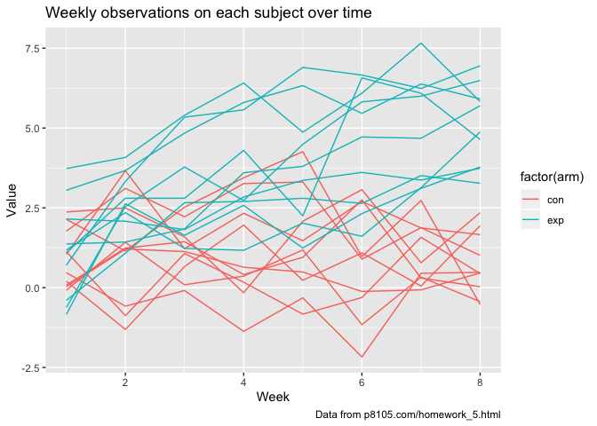

p8105\_hw5\_sl4659
================
Shenglin Liu
10/31/2019

## Problem 1

``` r
library(tidyverse)
```

    ## ── Attaching packages ─────────────────────────────────────────────────────────────── tidyverse 1.2.1 ──

    ## ✔ ggplot2 3.2.1     ✔ purrr   0.3.2
    ## ✔ tibble  2.1.3     ✔ dplyr   0.8.3
    ## ✔ tidyr   1.0.0     ✔ stringr 1.4.0
    ## ✔ readr   1.3.1     ✔ forcats 0.4.0

    ## ── Conflicts ────────────────────────────────────────────────────────────────── tidyverse_conflicts() ──
    ## ✖ dplyr::filter() masks stats::filter()
    ## ✖ dplyr::lag()    masks stats::lag()

``` r
library(rvest)
```

    ## Loading required package: xml2

    ## 
    ## Attaching package: 'rvest'

    ## The following object is masked from 'package:purrr':
    ## 
    ##     pluck

    ## The following object is masked from 'package:readr':
    ## 
    ##     guess_encoding

``` r
set.seed(20191029)
# load the iris dataset from the tidyverse package 
# introduce some missing values in each column
iris_with_missing = iris %>% 
  map_df(~replace(.x, sample(1:150, 20), NA)) %>%
  mutate(Species = as.character(Species))
# function that takes a vector as an argument; replaces missing values using the rules instructed
mis_replace = function(x) {
  output = vector(length = length(x))
  for (i in 1:length(x)) {
    if (is.numeric(x[i])) {
      mean = mean(x[!is.na(x)])
      if (is.na(x[i])) {
        output[i] = mean
      } else {
        output[i] = x[i]
      }
    } else if (is.character(x[i])) {
      if (is.na(x[i])) {
        output[i] = "virginica"
      } else {
        output[i] = x[i]
      }
    }
  }
  output
}
# apply mis_replace to the columns of iris_with_missing using a map statement
iris_fixed = map(iris_with_missing, mis_replace) %>%
  # convert list to data frame
  as.data.frame()
```

## Problem 2

``` r
# produce a character vector of the names of files in the data directory
file_ls = list.files("./data")
file_vec = paste("./data/", file_ls, sep = "")
# assign names to each element
names(file_vec) = file_ls
# apply read_csv to the each file using a map statement
study_df = map_df(.x = file_vec, ~ read_csv(file = .x), .id = "file") %>%
  mutate(
    arm = substring(file, 1, 3),
    subject_id = as.integer(substring(file, 5, 6))
  )
# tidy weekly observations
study_tidy_df = 
  pivot_longer(
    study_df, 
    week_1:week_8,
    names_to = "week", 
    names_prefix = "week_",
    values_to = "value")
study_tidy_df$week = as.integer(study_tidy_df$week)
# multiple groups with one aesthetic
ggplot(data = study_tidy_df, aes(x = week, y = value)) + 
# the group aesthetic maps a different line for each subject
  geom_line(aes(group = file, colour = factor(arm))) +
# title, label and caption
  labs(
    title = "Weekly observations on each subject over time",
    x = "Week",
    y = "Value",
    caption = "Data from p8105.com/homework_5.html"
  )
```

<!-- -->

From the spaghetti plot, we can conlude that in general, the experiment
group has greater values than the control group during the 8 week
observation period.

## Problem 3
